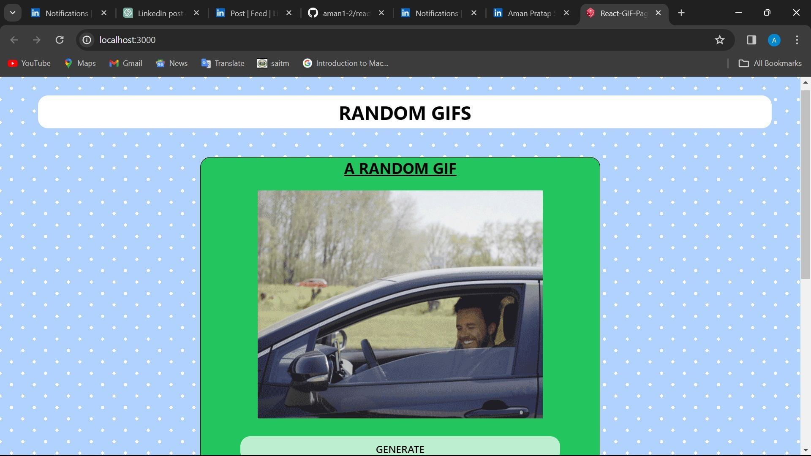
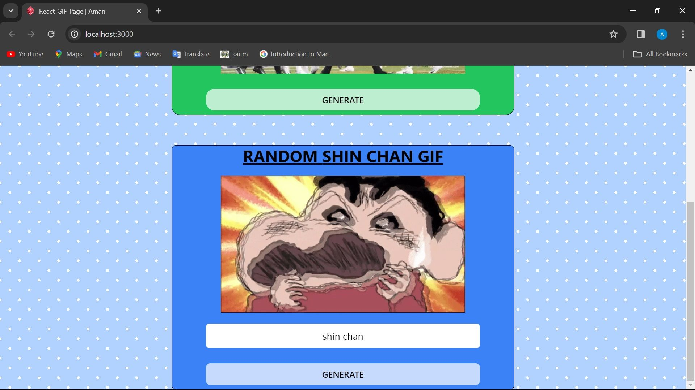

# Random Gifs Generator App

This React application fetches and displays random GIFs using the GIPHY API. It features two main components that allow users to view random GIFs and random GIFs based on a specific tag.

## Structure

The project is organized as follows:

- `App.jsx`: The main component that renders the application layout.
- `components/`: Directory containing UI components.
  - `Random.jsx`: Displays a random GIF and includes a button to fetch a new random GIF.
  - `Tag.jsx`: Allows the user to specify a tag and fetches a GIF based on this tag.
  - `Spinner.jsx`: A simple spinner component displayed while GIFs are loading.
- `hooks/`: Contains reusable React hooks.
  - `useGif.js`: A custom hook for fetching GIFs from the GIPHY API.

## Components

### App

The `App` component sets up the main layout of the application, featuring two sections:
- A header displaying the title "Random Gifs".
- Two sub-components (`Random` and `Tag`) that allow interaction with the GIPHY API to fetch and display GIFs.

### Random

The `Random` component uses the `useGif` hook to manage state and API interactions for fetching random GIFs. It displays:
- A button to trigger fetching a new random GIF.
- The GIF itself or a spinner if the GIF is loading.

### Tag

Similar to the `Random` component, `Tag` allows users to enter a tag to fetch relevant GIFs. It features:
- An input field to enter the tag.
- A button to fetch a GIF based on the provided tag.
- Display of the GIF or a spinner during loading.

### Spinner

This component provides a visual cue (spinner) indicating that data is being loaded.

## Hooks

### useGif

This custom hook is designed to fetch data from the GIPHY API. It handles API requests, state management for loading states, and updating the displayed GIF. It supports fetching random GIFs based on a provided tag.

## Setup

To run this project:
1. Clone the repository.
2. Install dependencies using `npm install`.
3. Set up your GIPHY API key in the environment variable `REACT_APP_GIPHY_API_KEY`.
4. Start the application using `npm start`.

## Usage

Upon launching the app, you will see two sections:
- The first section fetches and displays a random GIF.
- The second section allows you to specify a tag, fetch, and display a GIF related to that tag.

You can fetch new GIFs by clicking the 'Generate' buttons.

Enjoy exploring random GIFs and finding fun GIFs based on your favorite tags!
